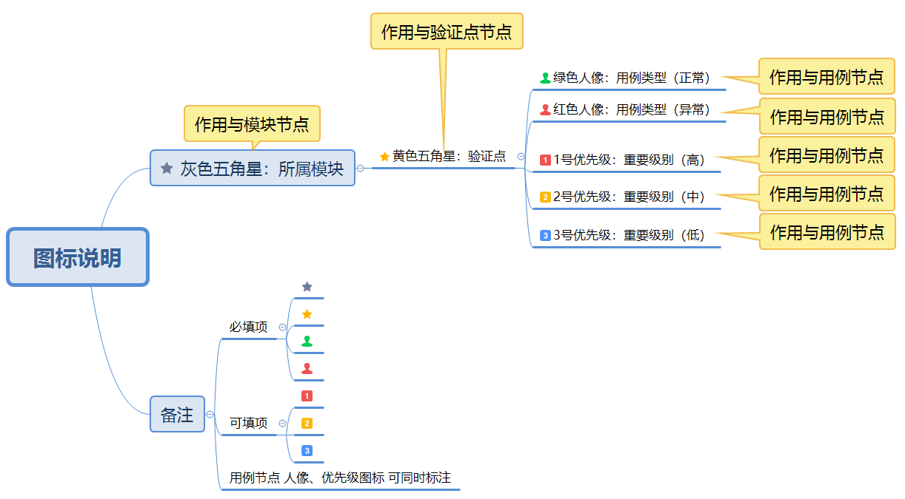
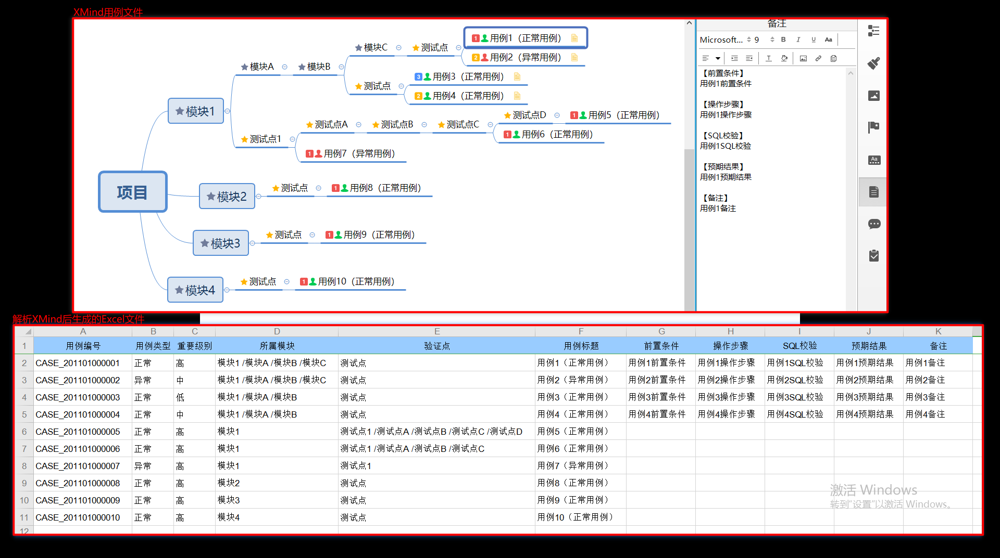

# README

这是一个可定制化的XMind用例解析工具（不限制XMind层级） 可根据自定义配置
将XMind中编写的测试用例导出至Excel（后期打算对XMind进行二次开发
直接将此工具集成到XMind中）

## Table of Contents

- [Background](#background)
- [Install](#install)
- [Usage](#usage)
  - [Generator](#generator)
- [Badge](#badge)
- [Example Readmes](#example-readmes)
- [Related Efforts](#related-efforts)
- [Maintainers](#maintainers)
- [Contributing](#contributing)
- [License](#license)

## Background

测试人员在编写测试用例时的痛点
- 在Excel中编写：效率低、无层次感、用例评审时无法直观突出体现
- 在XMind中编写：用例无法得到量化、不好统计、不利于用例库的积累
- 现有的XMind解析工具 大部分会限制层级（写的比较死
  不够灵活）、并且测试人员未按规范编写时 报错后不好排查

基于以上痛点 诞生出了此工具（XMindUtil）

## Install

****

| 工具          | 版本                                   |
|:-------------|:---------------------------------------|
| PyCharm工具   | 2021.1.1                               |
| Python工具    | 3.9.5                                  |
| XMind工具     | XMind 8 Update 9 (R3.7.9.201912052356) |
| xlrd依赖包    | 2.0.1                                  |
| xlwt依赖包    | 1.3.0                                  |
| xlutils依赖包 | 2.0.0                                  |
| xmind依赖包   | 0.1.0                                  |

****

## Usage

XMind图标规范说明（此规范可自定义）

### Generator

暂无

## Badge

暂无

## Example Readmes

效果展示

## Related Efforts

暂无

## Maintainers

暂无

## Contributing

暂无

## License

[博客](https://www.cnblogs.com/danhuai) |
[GitHub](https://github.com/JarvisFree) | © 维斯
